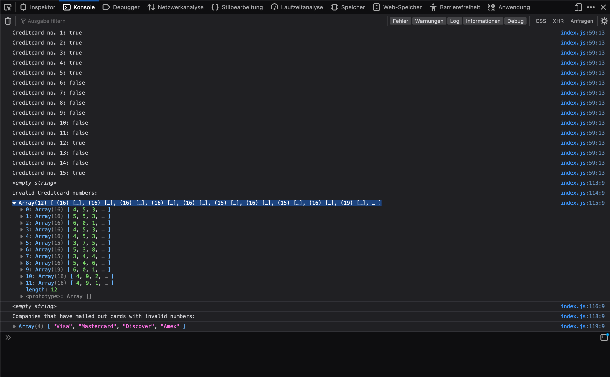

# Codecademy - Credit Card Checker

This is a solution to the [Challenge Project: Credit Card Checker](https://www.codecademy.com/paths/front-end-engineer-career-path/tracks/fecp-22-javascript-syntax-part-ii/modules/wdcp-22-credit-card-checker/projects/credit-card-checker).

## Table of contents

- [Overview](#overview)
  - [The challenge](#the-challenge)
  - [Screenshot](#screenshot)
  

## Overview

### The challenge

The challange was to build a Credit Card Checker.

I hope you like my code.

when u scroll a bit further you'll see Screenshots of my solution as well.

### Screenshot

